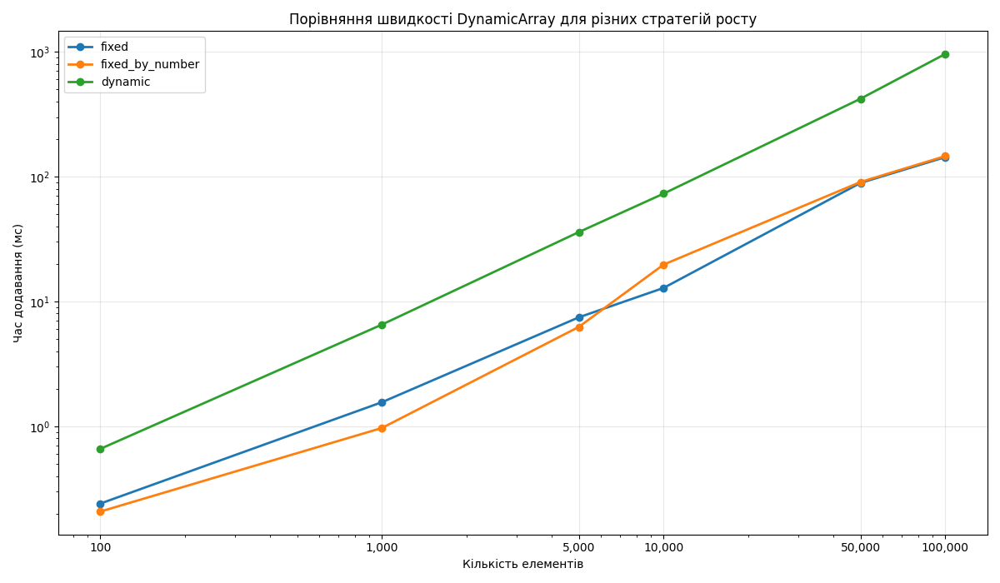
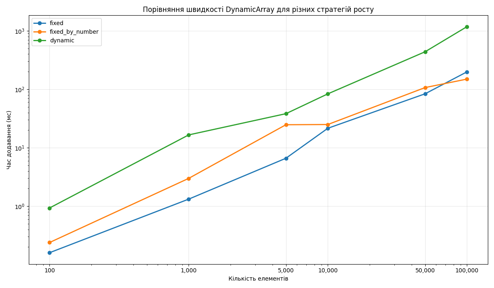
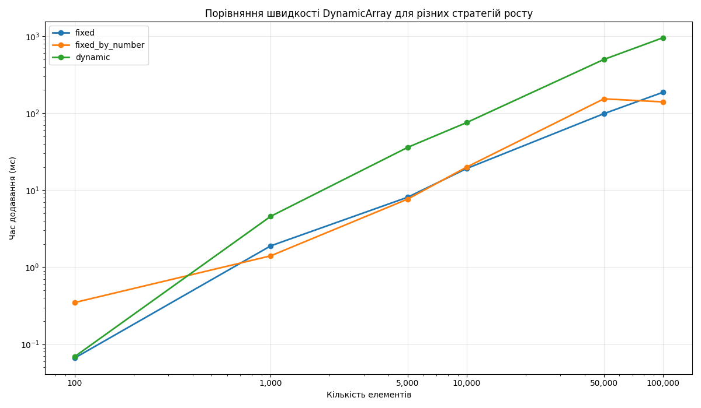

Для трьох стратегій зміни місткості динамічного масиву було здійснено серію з 10000 операцій додавання.
Для кожної стратегії вимірювались:
– кількість операцій перевиділення пам’яті;
– середня частка невикористаної пам’яті (у % від поточної місткості).

Отримані результати показали, що:
– стратегії з подвоєнням місткості мають меншу кількість перевиділень, але більшу частку невикористаної пам’яті;
– динамічна стратегія дає більшу кількість перевиділень, зате менший середній відсоток невикористаних елементів.# DynamicArray

8

fixed: 100 елементів - 0.19 мс
fixed: 1000 елементів - 1.32 мс
fixed: 5000 елементів - 11.14 мс
fixed: 10000 елементів - 24.19 мс
fixed: 50000 елементів - 100.24 мс
fixed: 100000 елементів - 158.31 мс

fixed_by_number: 100 елементів - 0.22 мс
fixed_by_number: 1000 елементів - 1.65 мс
fixed_by_number: 5000 елементів - 8.96 мс
fixed_by_number: 10000 елементів - 20.10 мс
fixed_by_number: 50000 елементів - 96.50 мс
fixed_by_number: 100000 елементів - 236.06 мс

dynamic: 100 елементів - 0.59 мс
dynamic: 1000 елементів - 6.66 мс
dynamic: 5000 елементів - 44.09 мс
dynamic: 10000 елементів - 78.60 мс
dynamic: 50000 елементів - 420.82 мс
dynamic: 100000 елементів - 1095.73 мс

32

fixed: 100 елементів - 0.16 мс
fixed: 1000 елементів - 1.32 мс
fixed: 5000 елементів - 6.60 мс
fixed: 10000 елементів - 21.50 мс
fixed: 50000 елементів - 83.61 мс
fixed: 100000 елементів - 198.57 мс

fixed_by_number: 100 елементів - 0.24 мс
fixed_by_number: 1000 елементів - 2.99 мс
fixed_by_number: 5000 елементів - 24.73 мс
fixed_by_number: 10000 елементів - 24.94 мс
fixed_by_number: 50000 елементів - 106.90 мс
fixed_by_number: 100000 елементів - 149.35 мс

dynamic: 100 елементів - 0.93 мс
dynamic: 1000 елементів - 16.56 мс
dynamic: 5000 елементів - 38.22 мс
dynamic: 10000 елементів - 83.41 мс
dynamic: 50000 елементів - 437.96 мс
dynamic: 100000 елементів - 1177.95 мс

128

fixed: 100 елементів - 0.07 мс
fixed: 1000 елементів - 1.89 мс
fixed: 5000 елементів - 8.11 мс
fixed: 10000 елементів - 19.13 мс
fixed: 50000 елементів - 98.38 мс
fixed: 100000 елементів - 186.22 мс

fixed_by_number: 100 елементів - 0.35 мс
fixed_by_number: 1000 елементів - 1.41 мс
fixed_by_number: 5000 елементів - 7.67 мс
fixed_by_number: 10000 елементів - 19.99 мс
fixed_by_number: 50000 елементів - 153.32 мс
fixed_by_number: 100000 елементів - 140.05 мс

dynamic: 100 елементів - 0.07 мс
dynamic: 1000 елементів - 4.58 мс
dynamic: 5000 елементів - 35.99 мс
dynamic: 10000 елементів - 75.60 мс
dynamic: 50000 елементів - 497.42 мс
dynamic: 100000 елементів - 951.72 мс

Порівняння результатів: 

| Стратегія       | Загальний мін (мс) | Загальний макс (мс) | Загальний середній (мс) |
| --------------- | ------------------ | ------------------- | ----------------------- |
| fixed           | 0.07               | 198.57              | ≈ 51.33                 |
| fixed_by_number | 0.22               | 236.06              | ≈ 55.30                 |
| dynamic         | 0.07               | 1177.95             | ≈ 275.83                |

