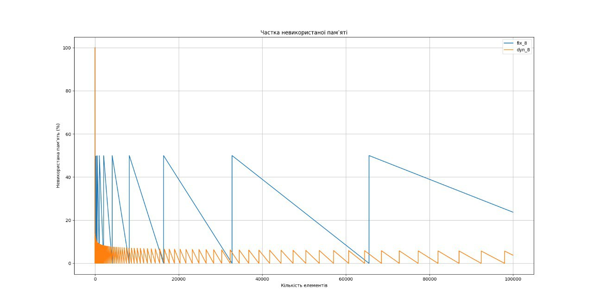
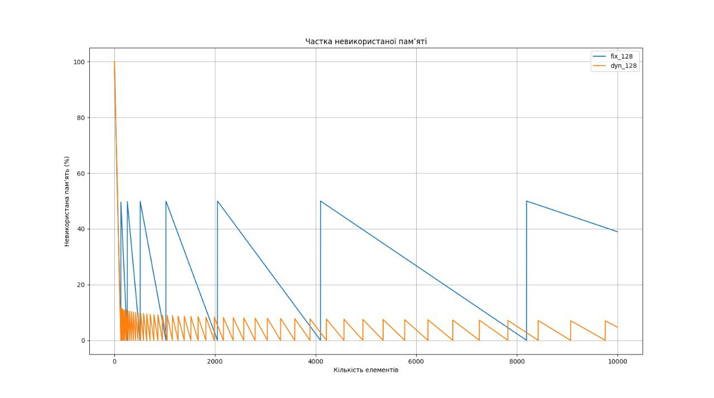
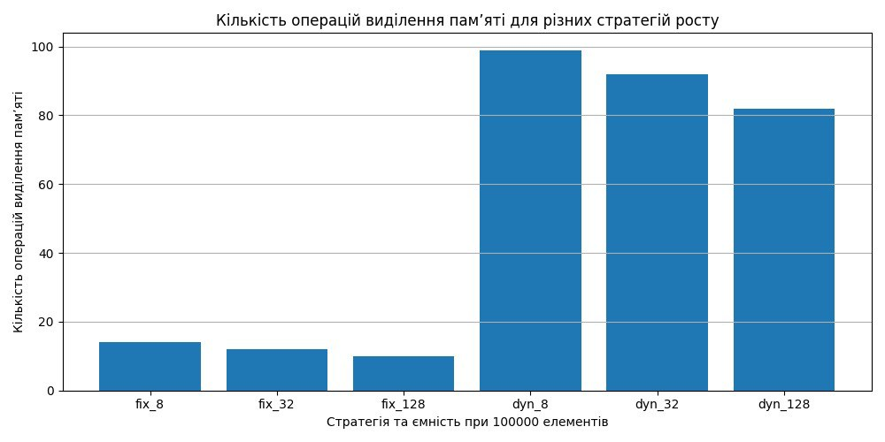
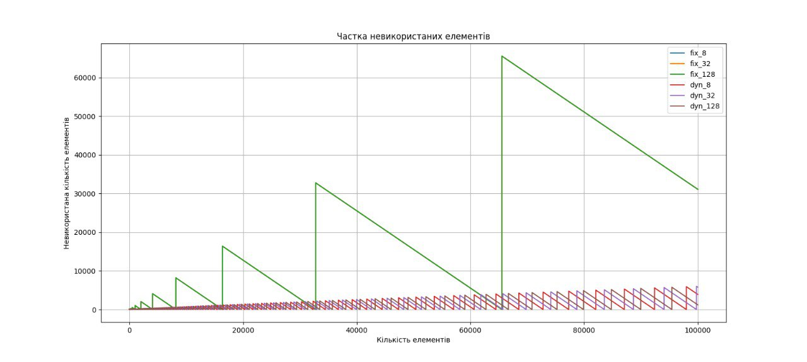

# DynamicArray
Ця записка мітсить аналіз реалізації динамічного масиву 

## Експерементальні результати
Попрівняльна таблиця результатів для заповнення масиву 

<table align="center">
    <thead>
        <tr>
            <th align="center">Name</th>
            <th align="center">Strategy</th>
            <th align="center">Initial capacity</th>
            <th align="center">Final size</th>
            <th align="center">Final capacity</th>
            <th align="center">Reallocations</th>
            <th align="center">Unused (%)</th>
            <th align="center">Final Unused (elements)</th>
        </tr>
    </thead>
    <tbody>
        <tr>
            <td><b>Fix 8</b></td>
            <td align="center">Fixed coefficient</td>
            <td align="center">8</td>
            <td align="center">100000</td>
            <td align="center">131072</td>
            <td align="center">14</td>
            <td align="center">50%</td>
            <td align="center">131072</td>
        </tr>
        <tr>
            <td><b>fix 32</b></td>
            <td align="center">Fixed coefficient</td>
            <td align="center">32</td>
            <td align="center">100000</td>
            <td align="center">131072</td>
            <td align="center">12</td>
            <td align="center">50%</td>
            <td align="center">131072</td>
        </tr>
        <tr>
            <td><b>Fix 128</b></td>
            <td align="center">Fixed coefficient</td>
            <td align="center">128</td>
            <td align="center">100000</td>
            <td align="center">131072</td>
            <td align="center">10</td>
            <td align="center">50%</td>
            <td align="center">131072</td>
        </tr>
        <tr>
            <td><b>Dynamic 8</b></td>
            <td align="center">Dynamic coefficient</td>
            <td align="center">8</td>
            <td align="center">100000</td>
            <td align="center">103883</td>
            <td align="center">19</td>
            <td align="center">17%</td>
            <td align="center">3883</td>
        </tr>
        <tr>
            <td><b>Dynamic 32</b></td>
            <td align="center">Dynamic coefficient</td>
            <td align="center">32</td>
            <td align="center">100000</td>
            <td align="center">105756</td>
            <td align="center">92</td>
            <td align="center">15.8%</td>
            <td align="center">5756</td>
        </tr>
        <tr>
            <td><b>Dynamic 128</b></td>
            <td align="center">Dynamic coefficient</td>
            <td align="center">128</td>
            <td align="center">100000</td>
            <td align="center">101189</td>
            <td align="center">82</td>
            <td align="center">15.6%</td>
            <td align="center">1189</td>
        </tr>
    </tbody>
</table>

## Графік частки невикористаної пам'яті

### Висновок
Стратегія з фіксованим коефіцієнтом збільшення (×2) призводить до того, що в середньому близько 50 % памʼяті залишається невикористаною незалежно від кількості елементів. Динамічна стратегія забезпечує ефективніше використання памʼяті (≈27–38 %), особливо при більшому початковому розмірі масиву, однак потенційно збільшує кількість операцій resize

## Графік кількості операцій виділеної пам'яті

### Висновок 
Фіксована стратегія подвоєння масиву забезпечує мінімальну кількість операцій виділення памʼяті, однак призводить до значних втрат памʼяті. Динамічна стратегія дозволяє ефективніше використовувати памʼять, проте збільшує кількість операцій resize у 2–3 рази.

## Графік частки невикористаних елементів

### Висновок 
Фіксована стратегія подвоєння масиву призводить до того, що в середньому половина виділеної памʼяті залишається невикористаною. Динамічна стратегія дозволяє зменшити кількість порожніх елементів на 20–45 %, причому ефект посилюється зі збільшенням початкової місткості масиву.

## Загальний висновок
### Отримані результати показали, що:
– стратегії з подвоєнням місткості мають меншу кількість перевиділень, але більшу частку невикористаної пам’яті;
– динамічна стратегія дає більшу кількість перевиділень, зате менший середній відсоток невикористаних елементів;